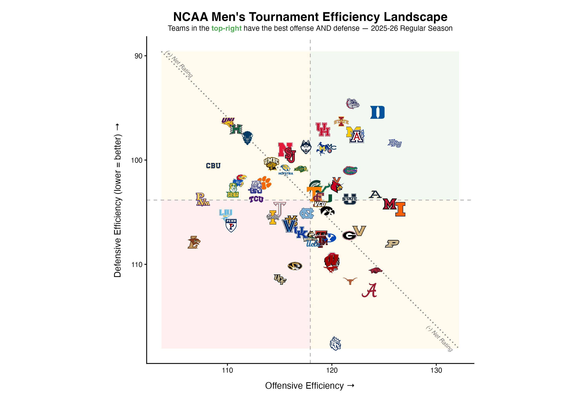

# NCAA MBB Team Efficiency Landscape

Every team plotted by offensive rating (points per 100 possessions) against
defensive rating, with dashed crosshairs at the average of the pool. Teams in
the shaded top-right quadrant are above average at both ends; bottom-left are
below average at both. The dotted diagonal is net rating zero, so distance
from it is how good a team is overall.

Logos are pulled from ESPN, so the chart is readable without a legend.



## Two scripts, run in order

| Script | What it does |
|---|---|
| `scripts/r/02_ncaa_mbb_efficiency_stat_grabber.R` | Pulls the season's team box scores from `hoopR`, pairs each team with its opponent per game, aggregates to season totals, and computes ORtg / DRtg / Net Rating. Writes a CSV. |
| `scripts/r/02.5_ncaa_mbb_efficiency_plot_beat_shaded_simplelabels.R` | Reads that CSV and draws the chart. |

Run the grabber first. Both default to your Desktop, so they line up with no
configuration — see the root README for `BBALL_HOME`.

## Configuring

**Season.** In the grabber, `load_mbb_team_box(seasons = 2026)` — `hoopR` uses
the END year, so 2026 means the 2025-26 season. Change it there, and in the
CSV/PNG filenames if you want more than one season on disk.

**Which teams.** Section 3.5 of the grabber filters to a hardcoded list of
teams (`tournament_teams`) — the 2026 NCAA tournament field. **Edit or delete
that list** to change the pool. Deleting the filter plots all of Division I,
which is dense; a conference is usually the more useful comparison.

Note the crosshairs sit at the mean of whatever pool you leave in, not at the
Division I mean. Against the tournament field, "average" is already a good team.

**Possessions** use the standard estimate:
`FGA + 0.44 × FTA + TOV − OREB`.

## Zoom

`zoom_factor` in section 3 of the plot script. Lower crops in on the middle of
the pack; higher pulls back to fit the outliers. The window is always square
and centred on the crosshairs, so the quadrants stay comparable.

## Packages

```r
install.packages(c("hoopR", "dplyr", "readr", "ggplot2", "ggimage", "ggtext"))
```

## Output

A PNG at 10×7in, 300dpi, transparent background.
