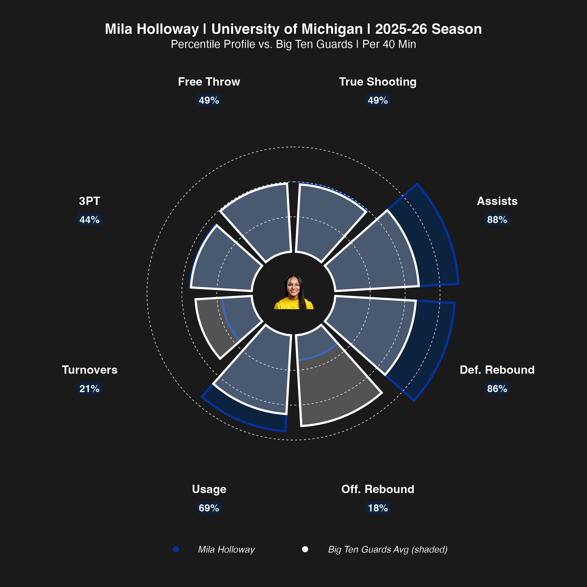

# NCAA WBB Player Pizza Plot

One player, eight metrics, each slice reaching as far as that player's
percentile inside the comparison pool. The pool is her conference, narrowed to
her **position group** — guards against guards — so a center isn't punished
for a low assist rate. A reference ring marks the position-group average, so
you can see at a glance which slices are actually above the bar.

Percentiles are minutes-weighted, and all rates are per 40 minutes (college
standard).



## The script

`scripts/r/6.25_wbb_pizza_plot.R`. Conference membership is resolved from
ESPN's conference/standings API, so any conference it knows about works by
name.

## Configuring

Edit the `CONFIG` block near the top:

```r
main_player     <- "Mila Holloway"           # player to feature
school          <- "University of Michigan"  # her school
conference_name <- "Big Ten"                 # comparison pool, partial match OK
season          <- 2026                      # END year: 2026 = 2025-26
headshot_local  <- ""                        # optional; falls back to ESPN's CDN
```

Run `get_wbb_conferences()` (defined in the script) to print every conference
name and ID you can pass to `conference_name`.

**Minimum minutes.** `min_minutes` is commented out by default, so end-of-bench
players are in the pool and percentiles run against everyone. To drop them,
uncomment `min_minutes` in CONFIG *and* the matching filter line in section 5b.
Note the featured player has to clear the threshold too.

## The eight slices

Grouped scoring / shooting / playmaking, so related metrics sit next to each
other rather than being scattered around the circle. Change the set in section
8.1 (`key_metrics_pctile`) — the labels, grouping colors and reference ring all
follow from that vector.

## Packages

```r
install.packages(c("wehoop", "dplyr", "readr", "ggplot2", "tidyr",
                   "cowplot", "magick", "httr", "jsonlite"))
```

`magick` is what composites the headshot onto the plot; the chart still renders
without a headshot if none is found.

## Data

`data/wbb_big_ten_2026.csv` is the conference pool behind the example chart —
one row per player, with raw per-40 rates and the weighted percentiles the
slices are drawn from.

## Output

A PNG at 8×8in, 300dpi, named
`pizza_plot_<player>_<conference>_<season>.png`.
