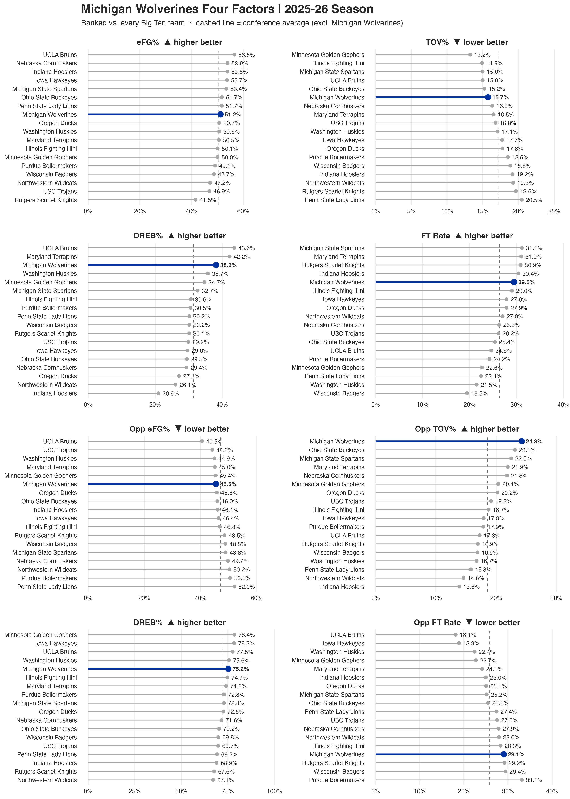

# NCAA WBB Team Four Factors

Compares one team to **every** team in its conference on the Four Factors —
one ranked dot-chart panel per factor, offense and defense.

Built for coach-facing viewing: raw values rather than percentiles, every
conference team visible by name, and the conference average marked as a dashed
reference line. Each panel is sorted so "better" is always at the top, with an
arrow in the panel title showing which direction that is.



## Configuring

Edit the `CONFIG` block near the top:

```r
school          <- "Michigan"    # team to feature (exact or partial)
conference_name <- "Big Ten"     # comparison pool (partial match OK)
season          <- 2026          # END year: 2026 = the 2025-26 season
ACCENT_COLOR    <- "#0033A0"     # highlight color
```

Pass a conference name that doesn't match and the script prints every valid
option before stopping. Same for the school, which lists the conference's teams.

### Naming the school

An exact name wins outright, so `"Michigan"` gives you Michigan and
`"Michigan State"` gives you Michigan State. Partial names work too, but only
when they're unambiguous — `"Mich"` matches both, so the script stops and lists
the candidates rather than guessing which one you meant.

## Factors

**Offense** — eFG%, TOV%, OREB%, FT Rate
**Defense** — Opp eFG%, Opp TOV%, DREB%, Opp FT Rate

Computed from season-long totals against *all* opponents, not just conference
games. The conference average is leave-one-out: it excludes the featured team,
so the reference line isn't dragged by the team being measured against it.

By default all 8 panels are drawn. For the offensive four factors only, see
`selected_metrics` in section 6.

## Packages

```r
install.packages(c("wehoop", "dplyr", "readr", "ggplot2", "tidyr",
                   "tibble", "httr", "jsonlite", "tidytext", "scales"))
```

## Output

A PNG at 10×14in, 300dpi, named
`team_four_factors_leaderboard_<team>_<conference>_<season>.png`.
