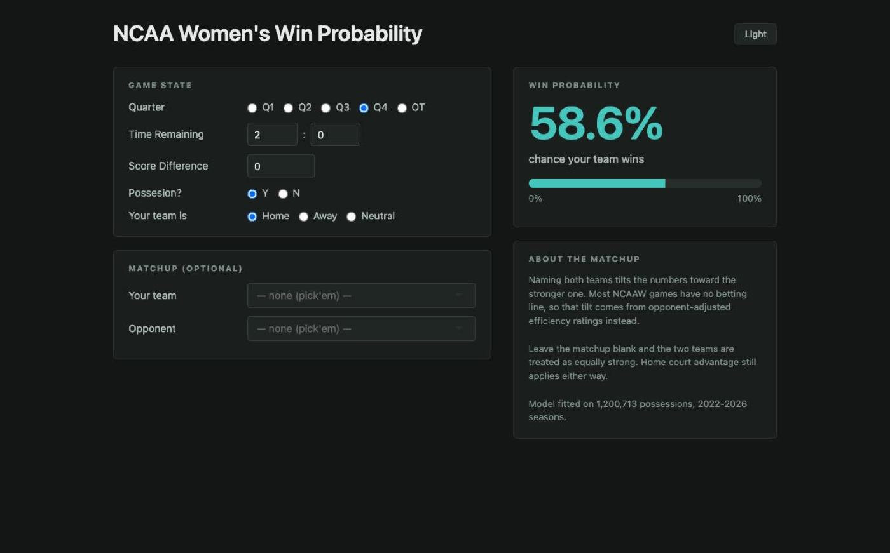

# NCAA Women's Win Probability

A win probability calculator for NCAA women's basketball. Describe a moment —
quarter, time left, score difference, who has the ball — and it returns the
chance your team wins.

### ▶ [Open the calculator](https://lineup-optimizer-wnba.shinyapps.io/ncaaw-win-probability/)

No install, no R, nothing to download. It follows your system's light or dark
setting, and the button in the corner overrides it.



## What it does that inpredictable's doesn't

It's modelled on [inpredictable's wpCalc](https://stats.inpredictable.com/nba/wpBox.php)
— same four controls — plus one thing theirs can't do: **name the two teams**.

Theirs is team-agnostic because accounting for a matchup normally needs a Vegas
line, and NCAAW doesn't have one for most games. So the model builds a
substitute from opponent-adjusted efficiency ratings. Name both teams and the
numbers tilt toward the stronger one; leave them blank and the two sides are
treated as equally strong.

Either way the **site always counts**. Home court is worth about 4 points in
NCAAW — far more than in the pro game — so it applies whether or not you've
named anyone. Leave the matchup blank and set the site to Neutral and you get
inpredictable's calculator back.

`NOTES_spread_substitute.md` covers how the rating-based spread was built and
why the NCAAW scale (routinely ±30) made exposing a raw spread control a bad
idea.

## The model

Fitted on **1.2 million possessions** across the 2022–2026 seasons. Six phases:

| Script | Phase |
|---|---|
| `01_possession_state.R` | possession-level game state from play-by-play |
| `02_game_states.R` | the state features the model is fitted on |
| `03_team_ratings.R` | opponent-adjusted efficiency ratings, the spread substitute |
| `04_training_set.R` | assembling the fitting set |
| `05_winprob_model.R` | the fit, plus cross-validation and calibration |
| `06_winprob_calc.R` | the runtime — this is all the app actually calls |

`run_*.R` are the drivers for each phase; `run_06_deploy.R` stages the
self-contained bundle that gets hosted.

## Running the app yourself

`app/app.R` is the Shiny source. It needs the fitted model
(`winprob_fit.rds`, 12MB) and the ratings board, neither of which is committed
here — the hosted link above is the same app with those bundled in.

**The pipeline scripts do not run standalone.** They read a tidy play-by-play
layer that isn't part of this repo, so they're here to show how the model was
built, not as something to execute. If you want to refit it against your own
data, `01_possession_state.R` is where the input contract is defined.

## Two things deliberately left out

**No free-throw control.** The runtime still derives free-throw states and is
still tested on them — it's only unexposed. The question a staff actually has
is "do we foul?", which needs both branches compared plus shooter quality and
elapsed time per branch. That's a separate tool, and half of it would mislead.

**No spread box.** The matchup produces a spread internally, but a number
that's simultaneously an output of the team pickers and an input to the model
reads as neither.

## A note on the possession estimate

The team ratings this model is built on (`03_team_ratings.R`) use the simple
box-score possession estimate:

```
FGA + 0.44*FTA + TOV - OREB
```

The other efficiency projects in this repo have since moved to Oliver's
estimate with the team-rebound adjustment, which reproduces NBA.com's published
ratings to within 0.06 where the simple version reads about 2 points low on
both ends — see
[`03_nba/team_efficiency`](../../03_nba/team_efficiency#the-possession-estimate-and-why-it-matters)
for that measurement.

This project has **not** been switched, deliberately. These ratings aren't
reported to anyone — they're an input the win probability model was fitted on,
so changing the estimator means refitting the model and redeploying, not just
editing a formula. And the change would largely wash out here anyway: the bias
hits both ends of a rating equally, and what feeds the model is the *difference*
between two teams' ratings.

Worth doing for consistency; not worth doing casually.

## Honest limits

- Under 5 seconds left it's barely better than "whoever leads wins", and the
  app says so.
- Overtime is modelled as its own 5-minute game, not as a fourth quarter.
- Ratings are a snapshot; the app shows the as-of date when a matchup is named.
