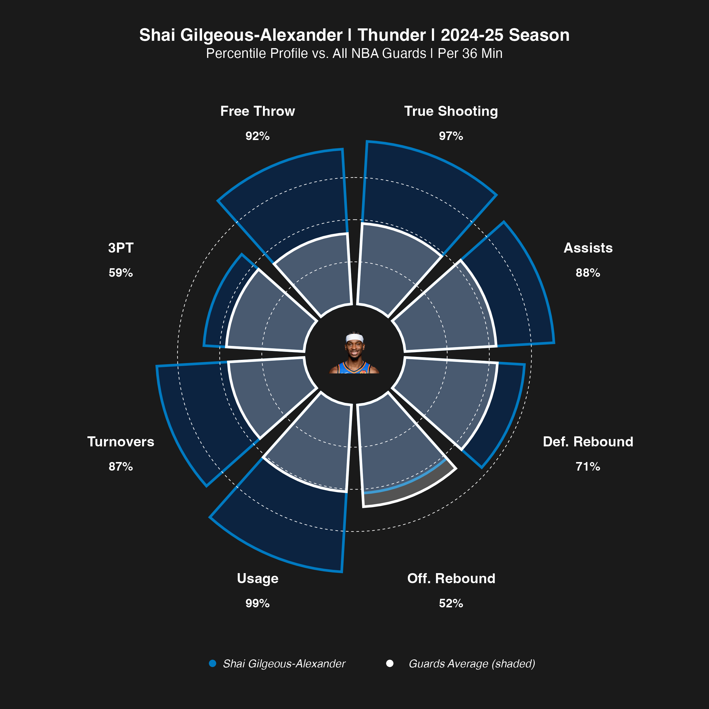

# NBA Player Pizza Plot

One player, eight metrics, each slice scaled to his percentile against the
league within his position group. Reference ring marks the position-group
average.

Same re-pointable design as the team chart: `hoopR` by default, or your own
player-box CSV.



## Scripts

| File | What it is |
|---|---|
| `scripts/r/nba_pizza_plot.R` | The script you run. |
| `scripts/r/nba_player_metrics.R` | Player-level rates and percentiles. |
| `scripts/r/nba_metrics.R` | Shared metrics layer, possessions, ratings, four factors. |
| `scripts/r/nba_data.R` | Fetch layer. |

`nba_pizza_plot.R` sources the other three from its own directory, so keep the
four together.

## Configuring

Section 1:

```r
MAIN_PLAYER <- "Shai Gilgeous-Alexander"
SEASON      <- 2025            # END year: 2025 = the 2024-25 season
SEASON_TYPE <- 2               # 2 = regular season
LABEL       <- "2024-25 Season"
INPUT_CSV   <- NULL            # NULL = pull from hoopR
```

## Packages

```r
install.packages(c("hoopR", "dplyr", "readr", "ggplot2", "tidyr",
                   "cowplot", "magick"))
```

## Output

A PNG at 8×8in, 300dpi.
