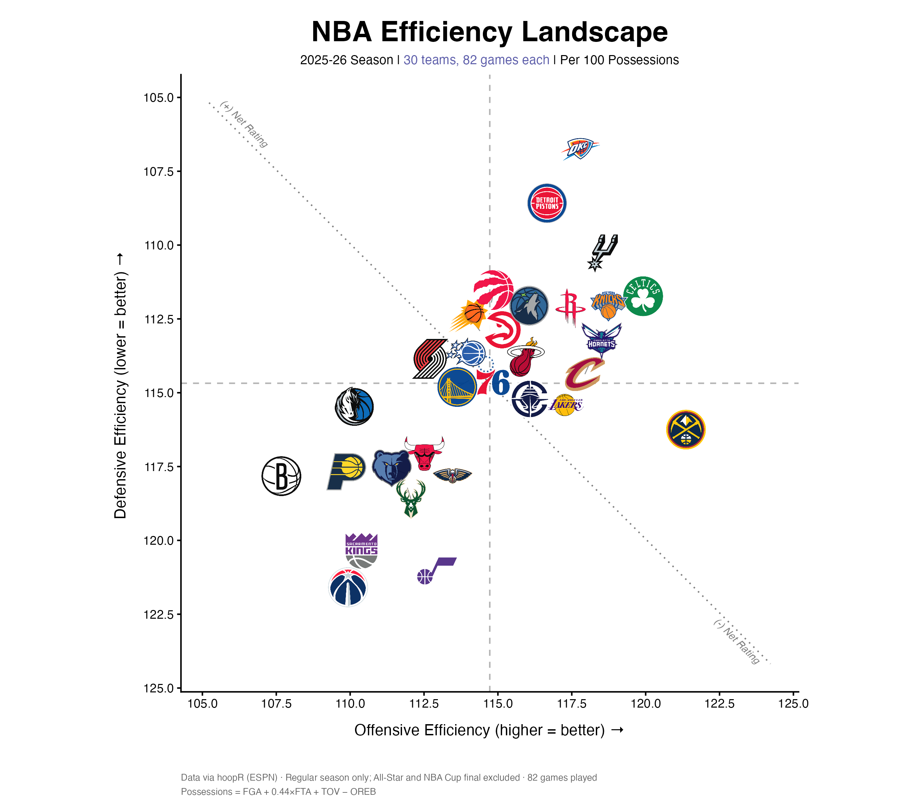

# NBA Team Efficiency Landscape

All 30 teams plotted by offensive rating against defensive rating, crosshairs
at the league average, logos instead of points. Top-right is good at both ends.

Written to be re-pointable: it pulls from `hoopR` by default, but will take a
CSV of team-game rows instead, so the same chart can be built from a scrape,
a vendor export, or anything else with the right columns.



## Scripts

| File | What it is |
|---|---|
| `scripts/r/nba_efficiency_plot.R` | The script you run. |
| `scripts/r/nba_metrics.R` | The metrics layer — possessions, ratings, four factors. Pure functions, no I/O. |
| `scripts/r/nba_data.R` | The fetch layer — everything that touches the network or disk. |

`nba_efficiency_plot.R` sources the other two from its own directory, so keep
the three together.

## Configuring

Section 1:

```r
SEASON      <- 2026          # END year: 2026 = the 2025-26 season
SEASON_TYPE <- "regular"     # "regular", "postseason", "play_in", "all"
INPUT_CSV   <- NULL          # NULL = pull from hoopR
LABEL       <- "2025-26"     # used in the title and filenames
```

### Using your own CSV

Set `INPUT_CSV` to a file with one row per team per game and these columns
(any capitalisation):

```
game_id, team_id, pts, fga, fgm, fg3m, fta, oreb, dreb, tov
```

If your column names differ, map them:

```r
INPUT_MAP <- c(tov = "turnovers", fg3m = "threes_made")
```

Logos need `team_abbreviation`. Without it the script falls back to labelled
points rather than failing — still readable, just not branded.

## The possession estimate, and why it matters

Ratings are points per 100 possessions, and possessions are estimated from the
box score. Which estimate you use moves the answer by about two points.

This uses Oliver's, averaged across the two teams:

```
FGA + 0.44*FTA + TOV - 1.07 * (OREB / (OREB + OppDREB)) * (FGA - FGM)
```

Validated against NBA.com across all 30 teams, 2025-26: mean error **+0.06
ORtg and +0.05 DRtg**, worst single team 0.64.

The simpler `FGA + 0.44*FTA + TOV - OREB` is often called the NBA.com formula,
but it does not reproduce NBA.com. It subtracts the raw offensive rebound
count, which undercounts extended possessions — team offensive rebounds and
missed-free-throw rebounds are never credited to a player, so they never reach
the box score. Measured across the same 30 teams it overstates possessions by
~1.8 a game and reads **2.0 points low on both ORtg and DRtg**.

Net rating is unaffected either way, since both ends shift together. It's the
components that were wrong.

## Two things worth knowing

**stats.nba.com doesn't work from R on some machines.** It blocks libcurl at
the TLS layer, so every `hoopR` `nba_*` function times out while the ESPN-backed
`load_nba_*` releases work fine and fast. That's why this uses `load_*`. The
reasoning is written up at the top of `nba_data.R`.

**`season_type == 2` is not just the regular season.** It also contains the
All-Star game and the NBA Cup final. `nba_drop_nonstandard()` in `nba_data.R`
strips those out by `notes_headline`.

## Packages

```r
install.packages(c("hoopR", "nbaplotR", "dplyr", "readr", "ggplot2",
                   "ggtext", "rlang"))
```

## Data

`data/NBA_Efficiency_2025_26.csv` is the season efficiency table behind the
example chart — one row per team. Committed so you can check the numbers
without running the pull.

## Output

The script writes four PNGs — landscape 10×7in and a 4:5 Instagram crop, each
opaque and transparent — plus the season efficiency CSV. Only the landscape
PNG is checked in here as an example.
