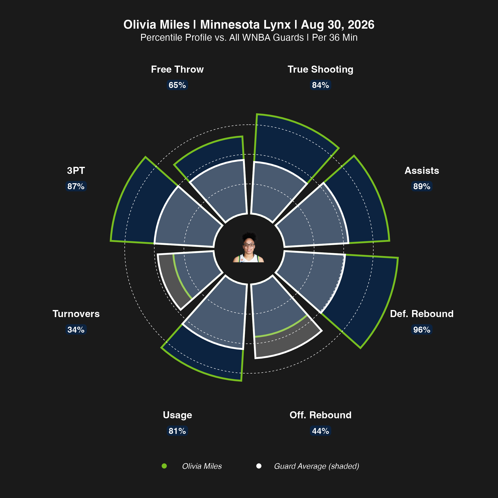

# WNBA Player Pizza Plot

The WNBA version of the pizza plot: one player, eight metrics, each slice
scaled to her percentile against the rest of the league within her position
group. A reference ring marks the position-group average.



## Configuring

Near the top of `scripts/r/01_wnba_pizza_plot.R`:

```r
main_player  <- "Olivia Miles"
player_team  <- "Minnesota Lynx"

PERIOD_LABEL <- "date"    # what the title says about scope
PERIOD_TEXT  <- NULL      # or override it with a string of your own
```

Swap in any player and the rest follows. The comparison pool is her own
position group, and the title names it from her position — put a center in and
it reads "vs. All WNBA Centers" with a "Center Average" legend.

### What the title says about scope

`PERIOD_LABEL` is read off the data that actually went into the chart, so it
can't go stale as the season runs on:

| Value | Title reads |
|---|---|
| `"date"` (default) | `Aug 30, 2026` |
| `"games"` | `39 Games` |
| `"asof"` | `As of Aug 30, 2026` |
| `"both"` | `39 Games \| Through Aug 30, 2026` |
| `"season"` | `2026 Season` |

`"date"` is the default because the title sits on one line with the player and
team; the longer forms crowd it.

Set `PERIOD_TEXT` to any string to override it — use that if you deliberately
want a fixed window, e.g. `PERIOD_TEXT <- "First 10 Games"`.

and the season in section 1:

```r
wnba_player_box_2026 <- load_wnba_player_box(seasons = 2026)
```

`wehoop` uses the END year, so 2026 is the 2026 season.

**Regular season only.** By default every game in the pull is included, which
means the All-Star game is in there too. Section 2 has a commented-out
`filter(season_type == 2)` — note that on the WNBA feed the All-Star game also
carries `season_type == 2`, so that filter alone won't remove it. If All-Star
inclusion matters for your comparison, filter on franchise `team_id` instead.

## Data freshness

`load_wnba_player_box()` serves a periodic data release rather than live ESPN,
and can lag completed games by up to a week. For an in-season chart, check the
last game date in the pull before you publish it. The team efficiency script
in [`04_wnba/team_efficiency`](../team_efficiency) shows the live top-up
pattern if you need it here.

## Packages

```r
install.packages(c("wehoop", "dplyr", "readr", "ggplot2", "tidyr",
                   "cowplot", "magick"))
```

## Data

The league pool behind the example chart:

- `data/wnba_player_season_2026_full.csv` — every computed column
- `data/wnba_player_season_2026_lab.csv` — the trimmed version

## Output

A PNG at 8×8in, 300dpi, named `pizza_plot_<player>_2025-26.png`, plus the two
CSVs above.

## Label spacing

The metric name and percentile badge are anchored at a fixed radius, set in
section 8.1b:

```r
LABEL_RADIUS <- 1.28   # where the labels sit; bars run 0-1
PLOT_MAX     <- 1.35   # panel extent -- this is what sets the wheel's size
```

The badge hangs inward from `LABEL_RADIUS`, so it has to clear a
100th-percentile slice. If you change the metric names or the font size and
they start crowding the bars, raise `LABEL_RADIUS`. Leave `PLOT_MAX` alone —
`coord_polar` runs with `clip = "off"`, so labels can sit outside the panel,
and raising it just shrinks the wheel.
