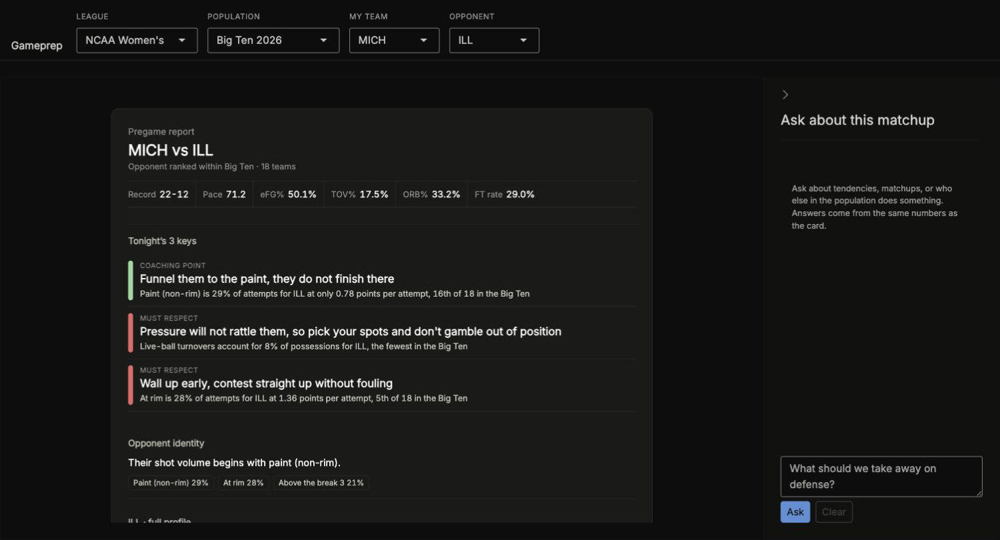

# Gameprep

A shared tidy layer for cross-league basketball, and three things built on it:
a **pregame card**, a **dashboard**, and a **scouting agent** that answers
questions from the same numbers the card shows.



## Why it sits outside the league folders

Everything else in this repo is one script producing one artifact. This is a
**library with several consumers**, and it spans leagues. Three things call
`get_lineup_stints()`, so there has to be exactly one definition of what a
stint is.

That is the opposite of the convention used elsewhere here, where logic is
deliberately repeated per script so each file downloads and runs alone. Nobody
downloads one file out of this.

## Running it

```sh
Rscript -e 'shiny::runApp("05_gameprep/consumers/dashboard")'
```

Pick a league, a population, and two teams. The card builds from cached
profiles; nothing is fetched at startup.

The **Ask** panel needs an Anthropic API key:

```sh
export ANTHROPIC_API_KEY=sk-ant-...
```

Without one the panel says so and the card still works. That is deliberate:
the analysis does not depend on the model.

## The card

Three keys, each an instruction with the number that produced it underneath:

> **COACHING POINT** Funnel them to the paint, they do not finish there
> Paint (non-rim) is 29% of attempts for ILL at only 0.78 points per attempt,
> 16th of 18 in the Big Ten

**Every phrase comes from `consumers/gameprep_cards/config/tactical_phrases.csv`,
never from code.** A row with no phrase produces no bullet rather than an
invented tactic. The `side` column is what keeps instructions on the correct
side of the ball: `weakness` ranks on the opponent's own **offensive**
percentile, so its phrases are defensive instructions.

Colour runs green to red on a ramp whose **lightness falls monotonically**, so
it survives deuteranopia on lightness alone rather than hue. Do not even out
the lightnesses to make it look smoother; that is exactly what breaks it.

## The agent

`R/agent.R` is a tool-calling loop over `QUERY_TOOLS` in `R/query_layer.R`. It
cannot reach anything else. Answers cite which tools ran.

The system prompt's prohibitions are not stylistic. Each corresponds to a
mistake this project actually made and fixed, and a model reasoning from raw
numbers would make them again. It will, unprompted, warn you that
points-per-possession, points-per-attempt and points-per-made-FG have
different denominators and should not be compared.

## Leagues

| `league` | Regulation | Period | OT | Source |
|---|---|---|---|---|
| `wnba` | 4 quarters | 600s | 300s | wehoop |
| `wbb` | 4 quarters | 600s | 300s | wehoop |
| `mbb` | 2 halves | **1200s** | 300s | hoopR |
| `nba` | 4 quarters | 720s | 300s | hoopR |

NCAA women's has used four 10-minute quarters since 2015-16, so `wbb` matches
the WNBA. NCAA men's halves are the outlier. **Every league difference lives in
`R/league_config.R`**; no other file branches on league.

## Adding a population

The dropdowns list whatever is cached. To add one:

```sh
Rscript 05_gameprep/scripts/build_profile.R wnba 2026
Rscript 05_gameprep/scripts/build_profile.R wbb 2026 "Big East"
```

It pulls a full season of play-by-play, so it takes minutes: WNBA about 30
seconds, NBA about two. `population` defaults to `national`, which is right
for the pro leagues; pass a conference name for college.

## What is committed

Four cached profiles, which are all the dashboard reads. The 828 per-game
stint and possession files are **not** here: 9MB of intermediates nothing in
this repo consumes. Rebuild them with `get_lineup_stints()` if you need them.

## Tests

```sh
Rscript -e 'library(testthat); source("05_gameprep/source_all.R");
            test_dir("05_gameprep/tests/testthat")'
```

556 assertions. Many are reconciliation rather than unit tests: points must
tie out against the box score, periods must tile exactly, possessions must be
mutually exclusive and exhaustive.

## Layout

```
R/                          the tidy layer, one function per file
  league_config.R           period lengths and package dispatch per league
  get_lineup_stints.R       lineup stint reconstruction
  possessions.R             possession segmentation
  shot_zones.R              court geometry, validated against stated distances
  team_play_profile.R       per-team-season category profiles
  query_layer.R             the read API, and the agent's tools
  agent.R                   the tool-calling loop
consumers/gameprep_cards/   card builder, renderer, phrase config
consumers/dashboard/        the Shiny app
data/tidy/<league>/profiles/
```

`R/` and `tests/testthat/` already match what an R package expects, so adding
a `DESCRIPTION` later needs no file moves.
