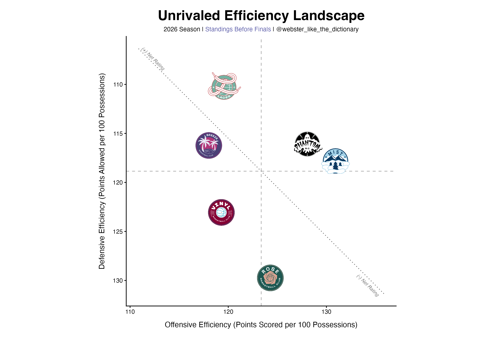

# Unrivaled Team Efficiency Landscape

Offensive rating against defensive rating for the Unrivaled 3x3 league, with
the crosshairs at the league average. The example is the eight playoff teams
as of March 3.

Unrivaled isn't covered by `wehoop` or `hoopR`, so the data comes from the
SportRadar Unrivaled API via a Python script, which writes a CSV that the R
script plots.



## Two scripts, run in order

| Script | What it does |
|---|---|
| `scripts/python/02_unrv_efficiency_stat_grabber.py` | Pulls season team stats from the SportRadar Unrivaled API v8, computes ORtg / DRtg / Net Rating, writes a CSV. |
| `scripts/r/02.5_unrv_efficiency_plot_Mar3.R` | Reads that CSV and draws the chart. |

## You need a SportRadar API key

Free trial keys are available at <https://developer.sportradar.com/>. The
script reads it from the environment and refuses to run without one — the key
is never stored in the file:

```sh
export SPORTRADAR_API_KEY='your_key_here'      # add to ~/.zshrc to persist
```

`ACCESS_LEVEL` is set to `"trial"`. Change it to `"production"` if you have
paid access. Requests are spaced 1.5s apart to stay inside the trial rate limit.

## Configuring

Python, in the CONFIG block:

```python
SEASON_YEAR = 2026
SEASON_TYPE = "REG"
```

R: the plot reads `Unrivaled_Efficiency_Mar3_2026_playoff_teams.csv`. Point it
at whatever the Python script actually wrote — the filenames here are dated
because they were snapshots taken through the season.

Team logos aren't in the API response. `fetch_team_logos()` in the Python
script maps team name to Unrivaled's CDN and adds a `logo` column, which is
what the plot draws — a new or renamed team needs adding to `logo_map_by_name`
there, not in the R script.

## Packages

```sh
pip install requests pandas
```

```r
install.packages(c("dplyr", "readr", "ggplot2", "ggimage", "ggtext"))
```

## Output

A PNG at 10×7in, 300dpi, transparent background.
