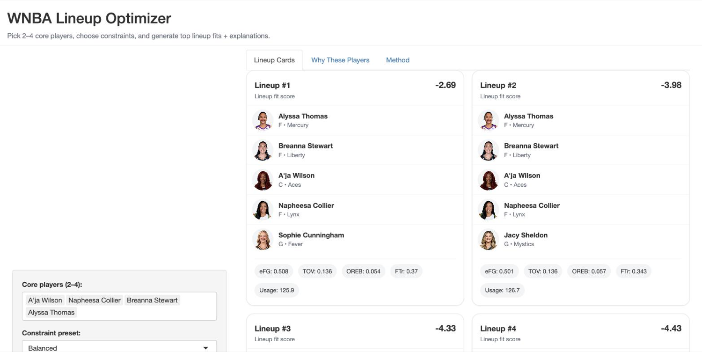

# WNBA Lineup Optimizer

Pick two to four core players, the engine completes the five under position
constraints and ranks the best fits, with an explanation of why each added
player showed up.



## Running it

```sh
Rscript -e 'shiny::runApp("06_lineup_optimizer/app")'
```

Self-contained: the app and its player file are the only things it needs.

**Give it three or four core players, not two.** With two it has to evaluate
roughly 350,000 combinations and Shiny is single-threaded, so the page sits
there with no feedback. With four it returns in seconds.

## What it optimizes

Four-factor weights, fitted league-wide on five seasons of WNBA team-games:

```r
lm(net_rating ~ efg_pct + tov_pct + oreb_pct + ft_rate)
```

```
fit = -72.89 + 144.51*eFG - 93.57*TOV + 47.20*OREB + 18.80*FTr
```

OREB and FT rate carry positive weight because that is what the league data
says. The engine was built to find lineups that shored up one roster's
offensive rebounding, and those weights are why it surfaces them.

**Usage-stress diminishing returns.** Total lineup usage is not free: as it
rises, each player's efficiency is discounted and turnovers inflated.

```r
stressed_efg = efg_pct / (usage_stress^0.25)
stressed_tov = tov_pct * (usage_stress^0.25)
```

So four ball-dominant stars do not simply stack. That is the point of the
model, and the most interesting thing it says.

**Contract-type filter.** Restrict the candidate pool by contract status
(Core, Rookie, RFA, UFA, Hardship, Reserved, Suspended), which turns "best
lineup" into "best lineup we could actually assemble."

## Reading the score

**It ranks lineups. It is not points per 100 possessions.**

The weights were fitted on *team* four factors, then applied here to
usage-weighted averages of *individual player* season rates. Those are
different quantities: team eFG runs about .520, while the player average in
this file is .4905. The intercept therefore sits about nine points low, and
feeding it league-average inputs returns **-9.18** where a calibrated
net-rating model would return 0.

The offset is a constant, so the ordering of lineups is untouched, and
ordering is the whole job. Compare lineups to each other, not to zero.

Making the number absolute means refitting against observed lineup net
ratings, not relabelling the intercept. Until then the label says what it is.

## Position constraints

| preset | G | F | C |
|---|---|---|---|
| Balanced | 1-3 | 1-3 | 1-2 |
| Big | 1-2 | 1-2 | 2 |
| Small | 2-4 | 2-3 | 0-1 |

`Minimum games played` is a sample-size guardrail, not a quality filter:
below it, a player's rates are too noisy to trust.

## Where the weights came from

`scripts/r/01_wnba_four_factor_weights.R` builds team-game four factors from
box scores and fits the regression. `01.5_generate_four_factor_weights.R` is
the same fit with the coefficients printed for pasting into the app.

Neither is needed to run the optimizer; they are here so the numbers in
section 2 of `app/app.R` are traceable rather than magic.
